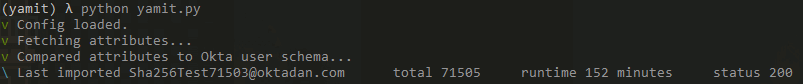
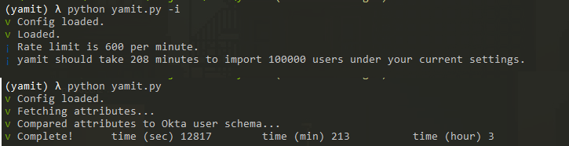

# yamit

[TOC]

This repository serves as a mass import tool for Okta. Currently out of the box import tools are limited. CSV imports are limited to 10k rows and do not support more advanced features like importing hashed passwords and importing with password inline hooks. This tool has the following capabilities:

* Mass user deletion
* Mass user import (from csv)
* Mass user password resets

All with configurable speeds based on your API rate limit. Let's get into the options shall we?

## config.ini

By default in `settings.py` you will see that it looks for a config.ini file. I've included a template which looks like:

```
[APP_SETTINGS]
MAX_CONCURRENT_SESSIONS = 20
ORG = https://yourorg.okta.com
API_TOKEN = 
CSV_FILE = users.csv
GROUP_ID = 
NOTIFY = 5
SPEED = 80
ACTIVATE = true

[PASSWORD_SETTINGS]
PASSWORD_TYPE = PLAIN
SALT =
SALT_ORDER =
WORK_FACTOR = 

[ADVANCED]
RESET_TIME_IN_SECONDS = 0
```

* Max concurrent session - this value can probably be left at 20, it specifies how many workers will be pulled in to do imports simultaneously
* Org - simply your full url of your Okta tenant
* Api token - this needs to be an API token created by a super administrator for the org specified in the Org setting
* Csv file - the name/[ath] of the csv file we will be importing your users from
* Group id - the unique id for the group we will be adding users to. If none is specified the tool will automatically created a group named "Import Group" for you. If there is a conflict with the name the tool will error out. Please specify a group to place these users in so you can revert any changes easily if you need to.
* Notify - tells you how often the tool will print to console. A value of 100 means it will print every for every 100th user.
* Speed - this is a percentage between 0 and 100 to specify how much of your api rate limit you want to use. Set it to 100 to go as fast as possible
* Activate - takes values true or false, this determines if the user will be created in an active state or not.
* Password type - Needs to be set to EMPTY, PLAIN, HOOK, or a hash algorithm. Supported algorithms are BCRYPT, SHA-512, SHA-256, SHA-1, or MD5.
* Salt order - will need to be POSTFIX or PREFIX. Mostly used in SHA algorithms.
* Work factor - needs to be specified for Bcrypt
* Reset time in seconds - used if you want to override information about your rate limit. You can specify manually how long you want to wait after receiving a 429 from Okta

## Running

After installing dependencies through 

```
pip install requirements.txt
```

You can run 

```
python yamit.py
```

There are a few options though

```
-d, --delete-users : will delete users in the specified group id
-x, --no-import : tells yamit to not actually run an import from csv (no longer needed)
-r, --reset-passwords : tells yamit that you want to reset the passwords of everyone in the group id
-i, --information : Checks config file and calculates estimated import time
```

if you just want to delete users:

```
python yamit.py -d
```

If you want to import users and then do password resets on all of them afterwards:

```
python yamit.py -r
```

And so on. There are a few planned features so always check back for run options on this readme.

## CSV Formatting

The first row of the CSV should be all of your attributes, and optionally a password column, like so:

```
"login","email","lastName","firstName","password"
```

Note that login, email, lastName, and firstName are required. Also, the names of these columns need to match the variable names for these attributes in Okta exactly. The tool checks this before an import and will error out if it is not correct.

In the case of hashed passwords, you may also need to include a salt, in that case your first row will look like:

```
"login","email","lastName","firstName","password","salt"
```

## Post-import

After the import you will receive a `log.csv` in the yamit directory which will inform you of runtime and any encountered errors. Just verify this against the numbers you see imported. If you need to undo everything, you can always run `python yamit.py -d`. 

## Issues

Please post issues as you find them. I am usually pretty active and quick with fixes. So far, the tool has not been tested with SHA-512 or MD5, only BCRYPT and SHA-256.
* There are issues with long-running imports in WSL2. Avoid using WSL2 with yamit.

## Screenshots



yamit also runs close to ideal limits:


